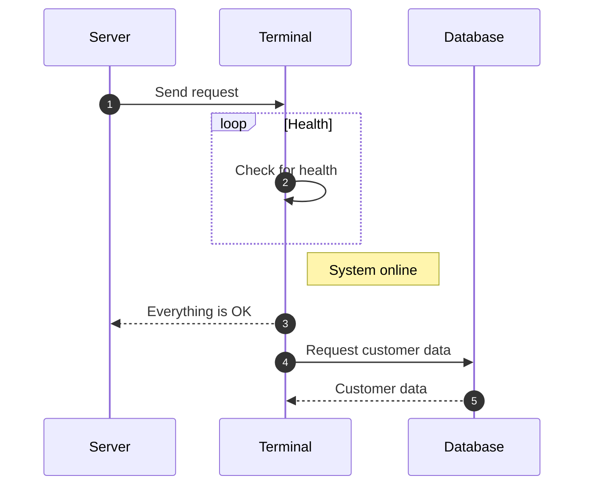

Um eine Aufgabe zu erstellen, öffnen Sie die Aufgabenverwaltung und führen folgende Schritte durch:

1. Klicken Sie auf das + oben rechts
1. Wählen Sie den Punkt "Aufabe" aus der Liste aus
1. Befüllen Sie die Felder
    * Überschrift
    * Beschreibung
    * Datum des Merge
    
1. Klicken Sie auf erstellen unten rechts

!!! note "Titel für die Warnung"
Mein Text für die Warung

!!! note "Collapsible callout":
mein Fließtext

Nun sehen Sie die erstellte Aufgabe in der Übersicht der Aufgabenverwaltung.